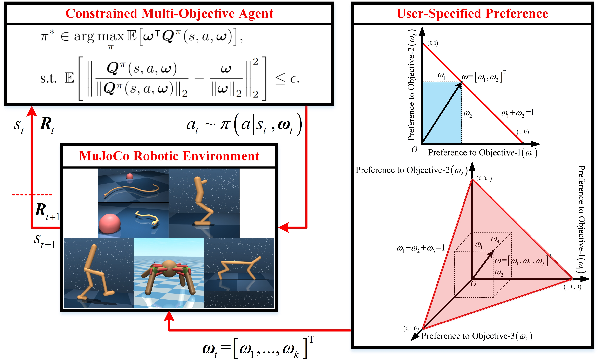
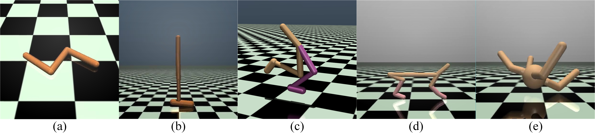
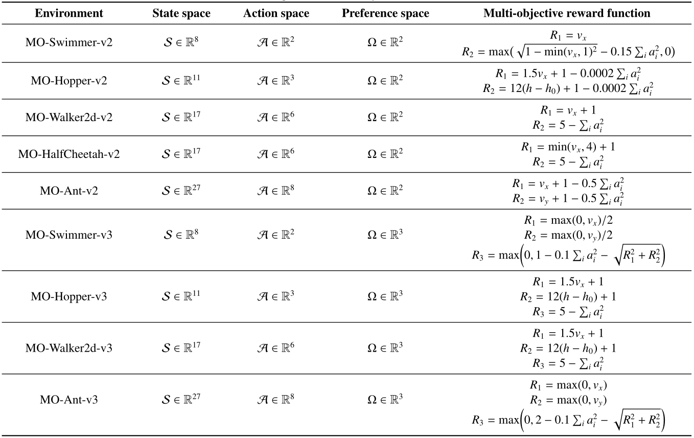

# PRC-CMORL
This repo is the implementation of our research "**[Personalized Robotic Control via Constrained Multi-Objective Reinforcement Learning](https://www.researchgate.net/publication/375254025_Personalized_robotic_control_via_constrained_multi-objective_reinforcement_learning)**".

## Introduction
### Diagram of the Proposed CMORL Framework for Personalized Robotic Control

Reinforcement learning is capable of providing state-of-art performance in end-to-end robotic control tasks.
Nevertheless, many real-world control tasks necessitate the balancing of multiple conflicting objectives while simultaneously ensuring that the learned policies adhere to constraints.
Additionally, individual users may typically prefer to explore the personalized and diversified robotic control modes via specific preferences.
Therefore, this paper presents a novel constrained multi-objective reinforcement learning algorithm for personalized end-to-end robotic control with continuous actions, allowing a trained single model to approximate the Pareto optimal policies for any user-specified preferences.
The proposed approach is formulated as a constrained multi-objective Markov decision process, incorporating a nonlinear constraint design to facilitate the agent in learning optimal policies that align with specified user preferences across the entire preference space.
Meanwhile, a comprehensive index based on hypervolume and entropy is presented to measure the convergence, diversity and evenness of the learned control policies.
The proposed scheme is evaluated on nine multi-objective end-to-end robotic control tasks with continuous action space, and its effectiveness is demonstrated in comparison with the competitive baselines, including classical and state-of-the-art algorithms.

### MuJoCo - Advanced Simulator for Robotics

(a) MO-Swimmer; (b) MO-Hopper; (c) MO-Walker2d; (d) MO-HalfCheetah; (e) MO-Ant.

###  Basic Description of Multi-Objective MuJoCo Environments

## Installation
This repo is developed using Python 3.7 and PyTorch 1.3.1+CPU in Ubuntu 16.04. 

We utilize the proposed CMORL approach to train the robotic agent in the popular [MuJoCo](https://mujoco.org/) (MuJoCo 2.0) platform.

We believe that our code can also run on other operating systems with different versions of Python, PyTorch and MuJoCo, but we have not verified it.

The required packages can be installed using

	pip install -r requirements.txt

